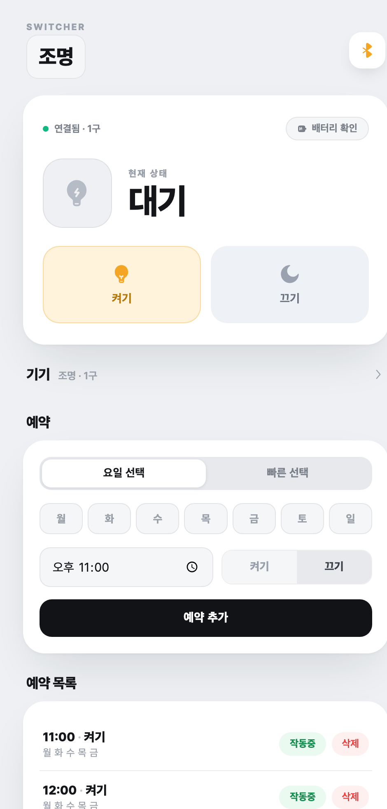

# 💡 I/O Switcher Local Server — V2

회사가 사라져 공식 앱을 사용할 수 없는 **아이오 스위처(I/O Switcher)**를 위한 독립형 로컬 제어 서버입니다.
공식 서버 없이도 맥북 또는 윈도우 PC를 통해 스위처를 제어하고 예약할 수 있습니다.

> **⚠️ iOS 사용자 안내**
> iOS의 블루투스 정책 제한으로 아이폰 브라우저에서는 BLE 기기 직접 제어가 불가능합니다.
> 반드시 **컴퓨터(맥/윈도우)를 서버로 함께 사용**해야 합니다.
> 컴퓨터가 완전 잠자기(sleep)에 들어가면 예약이 실행되지 않을 수 있으니, 전원을 연결하고 "디스플레이만 끄기" 상태로 두는 것을 권장합니다.

---

## 🆕 V2에서 달라진 점

V2는 여러 파일로 나뉘어 있던 구조를 **`switcher_server.py` 단일 파일**로 합치고, 몇 달간 실제로 매일 쓰면서 다듬은 버전입니다.

- **디자인 전면 개편** — 밝은 배경의 카드형 UI, 큰 버튼. 아이콘을 전부 파일 안에 내장해 인터넷이 끊겨도 UI가 깨지지 않습니다.
- **BLE 전송 자동 재시도** — 스위처의 블루투스 신호를 순간적으로 놓쳐 "버튼은 눌리는데 불이 안 켜지는" 문제를 자동 재시도(2초 간격 최대 3회)로 해결했습니다.
- **`switcher.local` 접속 버그 수정** — 주소 등록이 잘못되어 IP를 직접 입력해야만 접속되던 문제를 고쳤습니다. 이제 폰에서 `http://switcher.local:5001` 로 바로 접속됩니다.
- **연결 리셋 & 기기 잊기** — BLE 연결이 꼬여서 먹통이 됐을 때 앱에서 버튼 한 번으로 연결을 정리할 수 있습니다.
- **작동 중인 예약도 수정 가능** — 예약을 껐다 켜지 않아도 시간·요일·동작을 바로 고칠 수 있습니다.
- **타이머 프리셋** — 자주 쓰는 시간(분)을 탭 한 번으로 설정.
- **배터리는 탭해서 조회** — 자동 조회로 인한 블루투스 충돌을 없앴습니다.

> **⚠️ 2구 사용자 주의**
> V2는 2구 스위처를 **한꺼번에**(둘 다 켜기/둘 다 끄기) 제어하며, 초기에 실기기로 검증한 키 값을 사용합니다. V1에 있던 "구별 개별 제어"는 제거됐습니다. 2구 기기에서 동작이 이상하면 **Issues**로 제보해 주세요 — V1이 필요하면 [`v1` 태그](../../tree/v1)에서 받을 수 있습니다.



---

## ✨ 주요 기능

- **1구 & 2구 지원**
- **요일별 예약 & 타이머** — 작동 중에도 수정 가능
- **배터리 잔량 확인**
- **간편한 장치 등록** — 웹 UI에서 블루투스 스캔으로 장치 등록
- **연결 리셋 / 기기 잊기** — 꼬인 BLE 연결 복구

---

## 📁 프로젝트 구조

```
io-switcher-local-ios/
├── README.md
├── requirements.txt
└── switcher_server.py   ← 서버 + 웹 UI 전부 이 파일 하나
```

`config.json`(장치 정보)과 `schedules.json`(예약)은 첫 실행 후 같은 폴더에 자동 생성됩니다.

---

## 🚀 시작하기

### 🍎 macOS

터미널을 열고 아래 명령어를 순서대로 입력하세요.

```bash
# 1. Homebrew 설치 (이미 있다면 스킵)
/bin/bash -c "$(curl -fsSL https://raw.githubusercontent.com/Homebrew/install/HEAD/install.sh)"

# 2. Python 3.11 설치
brew install python@3.11

# 3. 필요 라이브러리 설치
python3.11 -m pip install flask bleak zeroconf
```

### 🪟 Windows

[Python 공식 홈페이지](https://www.python.org/downloads/)에서 Python 3.11 이상을 설치합니다.
설치 시 **"Add Python to PATH"** 를 반드시 체크하세요.

이후 명령 프롬프트(CMD) 또는 PowerShell에서:

```bash
pip install flask bleak zeroconf
```

---

## ▶️ 서버 실행

터미널이나 CMD에서 프로젝트 폴더로 이동한 뒤 실행하세요.

```bash
python3.11 switcher_server.py
```

> 윈도우이거나 버전 충돌이 생기면 `python switcher_server.py`

실행 후 터미널에 아래와 같이 뜨면 성공입니다.

```
🌐 mDNS 등록 완료: http://switcher.local:5001

✅ 서버 시작!
📱 폰에서 접속: http://switcher.local:5001
```

---

## 📱 사용 방법

1. 폰 브라우저 주소창에 **`http://switcher.local:5001`** 을 입력합니다.
   (`http://` 포함 필수. `https`로 자동 변환되면 접속이 안 됩니다. 안 되면 터미널에 표시된 IP 주소로 접속하세요.)
2. 우측 상단 블루투스 버튼 → **주변 장치 스캔**으로 스위처를 찾아 저장합니다.
3. 메인 화면에서 ON/OFF, 예약, 타이머를 자유롭게 사용하면 됩니다.

### 📱 스마트폰에서 앱처럼 사용하기 (PWA)

매번 브라우저를 열고 주소를 입력하는 번거로움 없이, 홈 화면에 추가하여 **아이콘 클릭 한 번으로 접속**할 수 있습니다.

#### **🍎 아이폰 (Safari) 기준**
1. 아이폰 **Safari** 브라우저에서 서버 주소로 접속합니다.
2. 하단 바 중앙의 **[공유 버튼]** (내보내기 아이콘 📤)을 누릅니다.
3. 리스트를 아래로 내려 **[홈 화면에 추가]**를 선택합니다.
4. 이름을 '스위처'로 설정하고 추가하면 홈 화면에 전용 아이콘이 생깁니다.

#### **🤖 안드로이드 (Chrome) 기준**
1. **Chrome** 브라우저에서 서버 주소로 접속합니다.
2. 우측 상단 **[점 세 개]** (메뉴) 아이콘을 누릅니다.
3. **[홈 화면에 추가]** 또는 **[앱 설치]**를 선택합니다.

---

## ⬆️ V1에서 업그레이드하기

1. 새 `switcher_server.py`를 받습니다 (`git pull` 또는 파일 다운로드).
2. 기존에 쓰던 `switcher/config.json`과 `switcher/schedules.json`을 **`switcher_server.py` 옆으로 복사**하면 장치·예약이 그대로 유지됩니다. (파일 형식이 같습니다.)
3. 복사하지 않아도 웹 UI에서 다시 스캔·등록하면 됩니다.
4. 자동 시작을 등록해뒀다면 아래의 새 plist 내용으로 바꿔주세요 (실행 명령이 바뀌었습니다).

---

## ⚙️ 자동 시작 설정 (부팅 시 자동 실행)

### 🍎 macOS — LaunchAgent

`~/Library/LaunchAgents/com.switcher.server.plist` 파일을 생성합니다.

```xml
<?xml version="1.0" encoding="UTF-8"?>
<!DOCTYPE plist PUBLIC "-//Apple//DTD PLIST 1.0//EN"
  "http://www.apple.com/DTDs/PropertyList-1.0.dtd">
<plist version="1.0">
<dict>
  <key>Label</key>
  <string>com.switcher.server</string>
  <key>ProgramArguments</key>
  <array>
    <string>/opt/homebrew/bin/python3.11</string>
    <string>switcher_server.py</string>
  </array>
  <key>WorkingDirectory</key>
  <string>/Users/YOUR_USERNAME/io-switcher-local-ios</string>
  <key>RunAtLoad</key>
  <true/>
  <key>KeepAlive</key>
  <true/>
</dict>
</plist>
```

`YOUR_USERNAME`과 `WorkingDirectory` 경로를 본인 환경(레포를 받아둔 폴더)에 맞게 바꾼 뒤 터미널에서 등록합니다.

```bash
launchctl load ~/Library/LaunchAgents/com.switcher.server.plist
```

이후 코드를 업데이트했을 때는 아래 명령으로 재시작하면 됩니다.

```bash
launchctl kickstart -k gui/$(id -u)/com.switcher.server
```

### 🪟 Windows — 시작프로그램 등록

`Win + R` 키를 누르고 `shell:startup` 입력 → 시작프로그램 폴더가 열립니다.
해당 폴더에 `switcher_server.py`의 바로가기를 만들면 부팅 시 자동 실행됩니다.

---

## 🧹 기기 내장 예약 삭제 (유령 예약 청소)

공식 앱이 중단되면서 기기 본체에 저장된 예약을 지우지 못해 발생하는 **'유령 예약(멋대로 불이 켜지는 현상)'**을 해결하는 방법입니다. 기기 내부에 기록된 스케줄을 초기화하여 원치 않는 작동을 방지합니다.

### 1단계: 내 스위처 주소 확인하기
먼저 내 스위처의 고유 주소를 찾아야 합니다. 터미널에 아래 내용을 통째로 복사해서 붙여넣고 엔터를 치세요.

```bash
# 블루투스 스캔 도구 생성 및 실행
cat > /tmp/find_switcher.py << 'EOF'
import asyncio
from bleak import BleakScanner
async def main():
    print("주변 블루투스 기기 찾는 중... 10초만 기다려주세요.")
    devices = await BleakScanner.discover(timeout=10)
    for d in devices:
        name = d.name or "이름없음"
        if "switcher" in name.lower() or "io" in name.lower():
            print(f"★ 발견! [{name}]: {d.address}")
        else:
            print(f"  [{name}]: {d.address}")
asyncio.run(main())
EOF

python3.11 /tmp/find_switcher.py
```

결과 확인: 10초 뒤 목록이 나옵니다. **★ 표시가 된 주소(D2F7... 형태)**를 복사해두세요.
팁: 이름이 헷갈린다면 스위처 전원을 뺐을 때 목록에서 사라지는 주소가 바로 당신의 기기입니다.

2단계: 예약 삭제 실행하기
아래 코드에서 ADDR = "여기에_주소_붙여넣기" 부분만 본인의 주소로 수정한 뒤 터미널에 붙여넣으세요.

```Bash
# 예약 삭제 도구 생성 및 실행
cat > /tmp/del_timers.py << 'EOF'
import asyncio, datetime
from bleak import BleakClient

# ↓ 아래 큰따옴표 안에 복사한 주소를 넣어주세요
ADDR = "여기에_주소_붙여넣기"

TIMER_OP   = "000015ca-0000-1000-8000-00805f9b34fb"
TIMER_READ = "000025ca-0000-1000-8000-00805f9b34fb"

def make_version(size_gt_1: bool) -> bytes:
    if size_gt_1:
        n = datetime.datetime.now()
        return bytes([n.hour, n.minute, n.second])
    return bytes([0xFF, 0xFF, 0xFF])

async def main():
    print(f"스위처({ADDR})에 연결을 시도합니다...")
    async with BleakClient(ADDR) as c:
        before = await c.read_gatt_char(TIMER_READ)
        print(f"현재 예약 상태: {before.hex()}")
        
        print("슬롯 0~3 예약 삭제 시작...")
        for slot in range(4):
            ver = make_version((4 - slot) > 1)
            payload = bytes([0x01, slot, 0, 0, 0, 0, 0]) + ver
            await c.write_gatt_char(TIMER_OP, payload, response=True)
            print(f"  - 슬롯 {slot} 삭제 완료")
            await asyncio.sleep(0.5)
            
        await asyncio.sleep(1)
        after = await c.read_gatt_char(TIMER_READ)
        if after.hex().startswith("ff" * 20):
            print("\n✅ 모든 내장 예약이 삭제되었습니다. 이제 귀신 현상은 없습니다!")
        else:
            print("\n⚠️ 일부 데이터가 남았습니다. 기기 재부팅 후 한 번 더 시도해주세요.")
asyncio.run(main())
EOF

python3.11 /tmp/del_timers.py
```

⚠️ 참고사항
기기 안전: 이 도구는 기기 안에 저장된 예약 데이터만 초기화할 뿐, 기기 하드웨어나 펌웨어 자체를 손상시키지 않습니다.
기능 유지: 기기의 수동 버튼 작동이나 본 서버(`switcher_server.py`)를 통해 새롭게 설정하는 예약 기능은 그대로 사용 가능합니다.
충돌 방지: 서버가 이미 실행 중이라면 서버를 잠시 끈 뒤 이 청소 도구를 실행해야 블루투스 통신 충돌이 발생하지 않습니다.

---

## ⚠️ 주의사항

- **같은 Wi-Fi 필수** — 서버(컴퓨터)와 클라이언트(폰)가 반드시 같은 네트워크에 있어야 합니다.
- **접속이 안 될 때** — 폰 브라우저를 완전히 닫았다 다시 열어보고, 그래도 안 되면 터미널에 표시된 IP로 직접 접속해 보세요. 맥 시스템 설정에서 Python의 네트워크(로컬 네트워크) 접근이 허용돼 있는지도 확인하세요.
- **불이 안 켜질 때** — V2는 자동으로 3회까지 재시도하므로 버튼이 몇 초 돌다가 성공하는 것이 정상입니다. 계속 실패하면 우측 상단 블루투스 메뉴의 **연결 리셋**을 눌러보세요.

---

버그 제보나 기능 제안은 **Issues** 탭을 이용해 주세요.
